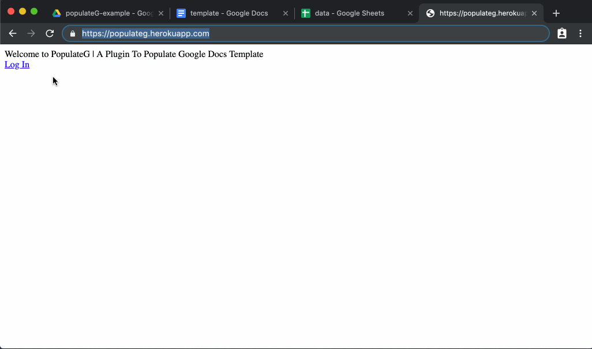

# populateG | A Web Application To Populate Google Docs Template 

Use the application to populate the your own Google Docs Template by using the data present in your Google Spreadsheets.
Just tag your Document using the headers used in your Google Spreadsheets.

See the example of the Template Document and the Data Spreadsheet: [**here**](https://drive.google.com/open?id=1o5p9L2EOf6WPP_DiZxvo380E7nl7SO71)

[**Try it here**](https://populateg.herokuapp.com/)

## Sample Example

## How to tag the template?
As shown in above gif, to create template, you have to tag your document with the headers specified in your spreadsheet by enclosing them into 2 curly braces, **`{{`**.

Like, if the header is **`name`**, then use **`{{name}}`** as the tag.

## Run Locally
Just, setup GoLang in your system. 
And Run `go get github.com/Shivam010/populateG` or just clone the repo. Now, run `go run .` in the project. 
If in $GOPATH use `GO111MODULE=on go run .`, see [`./init.go`](./init.go) file for environment variables setup. 

## Request for Contribution
Changes and improvements are more than welcome!!  
Feel free to fork, create issues or pull a request.  
And be sure to review the [contributing guidelines](./CONTRIBUTING.md) and [code of conduct](./CODE_OF_CONDUCT.md).

## License
The application, its design and code all are licensed under the [MIT license.](./LICENSE)
 